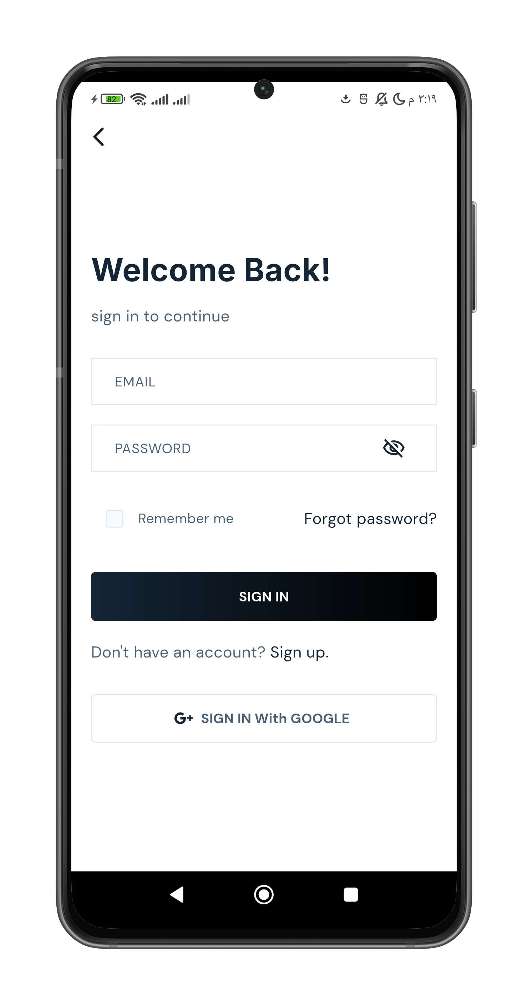
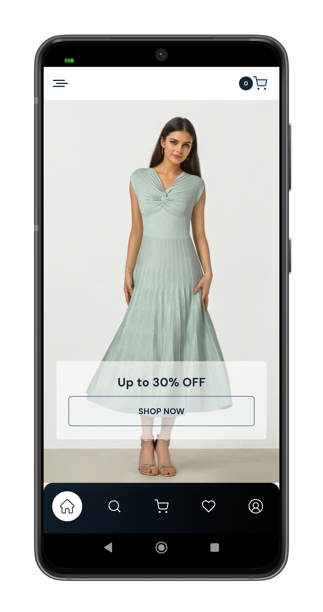
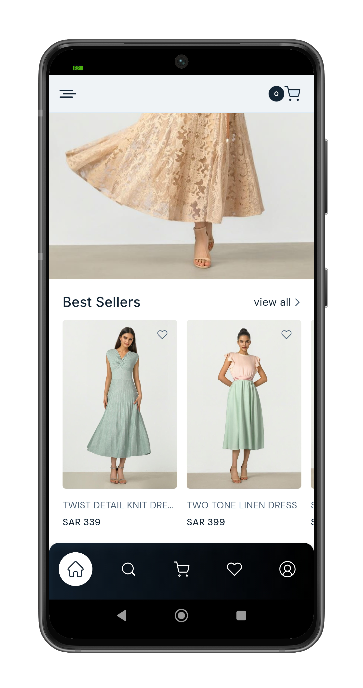
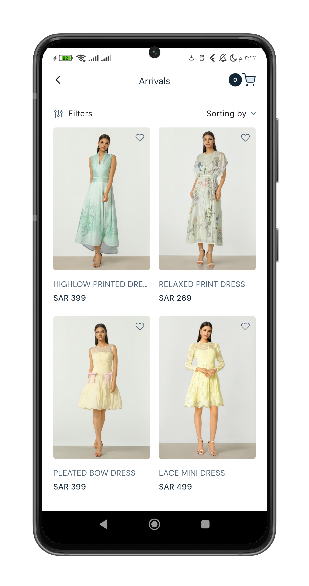
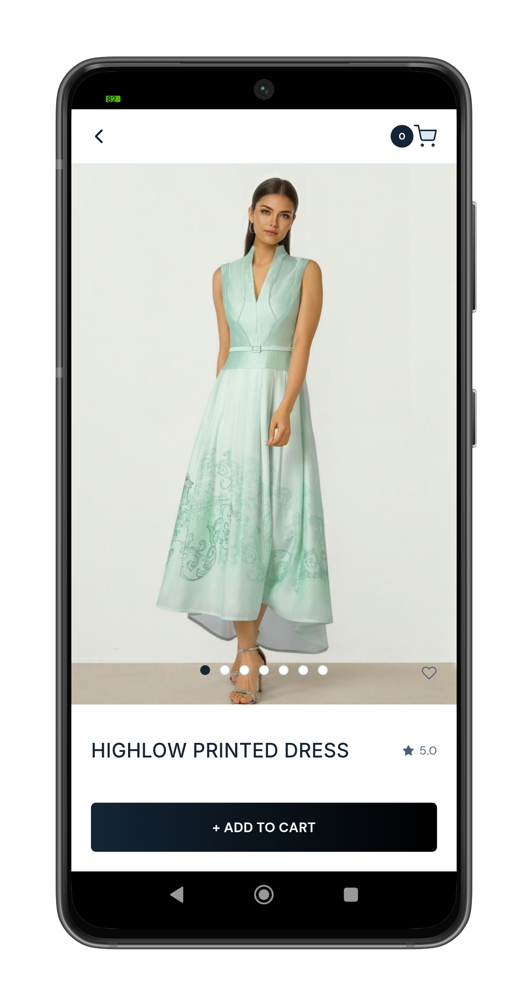
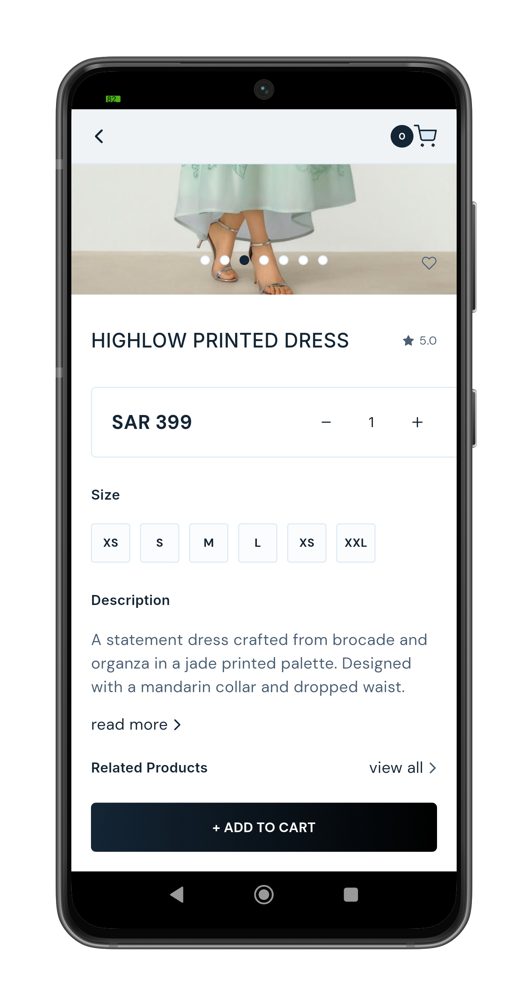
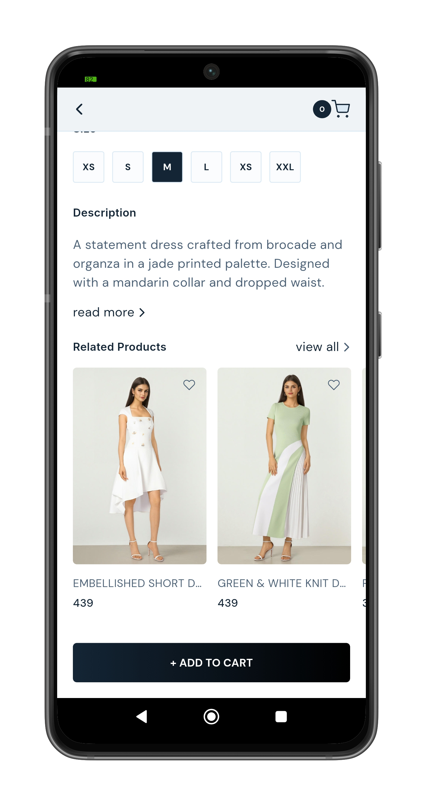
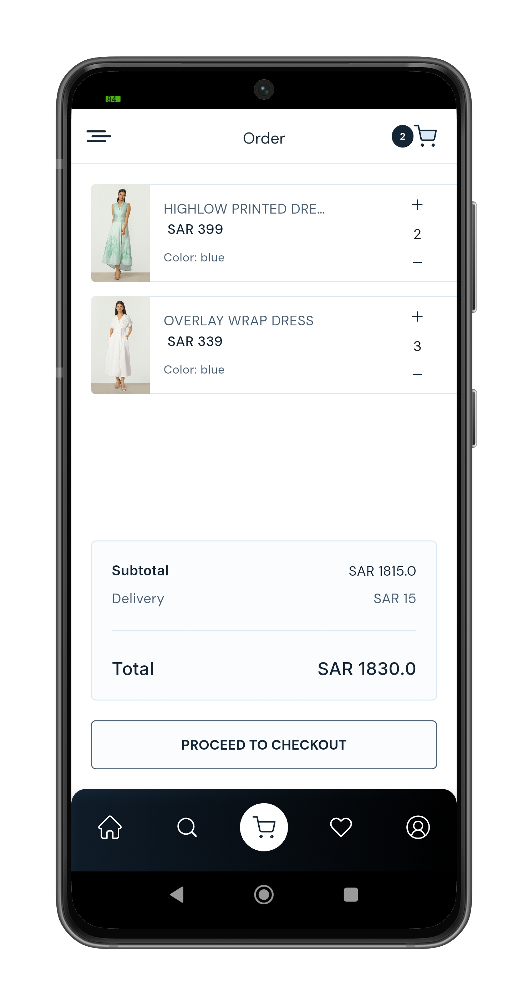
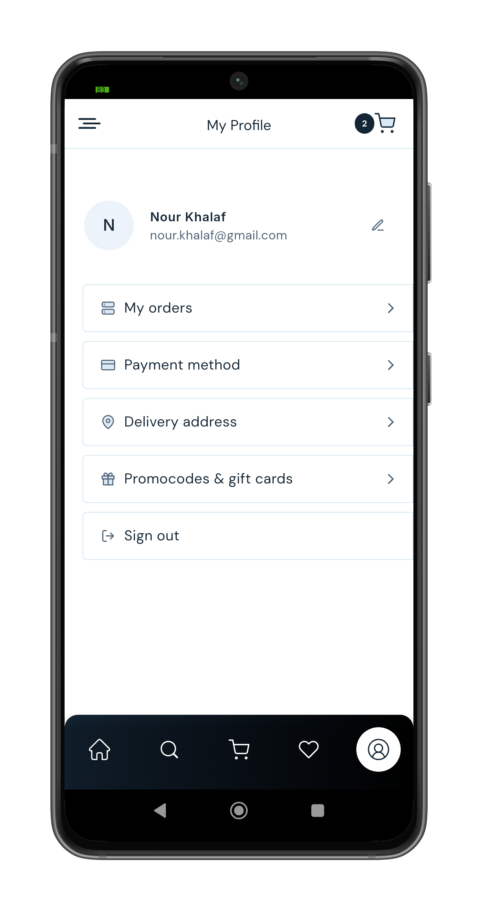
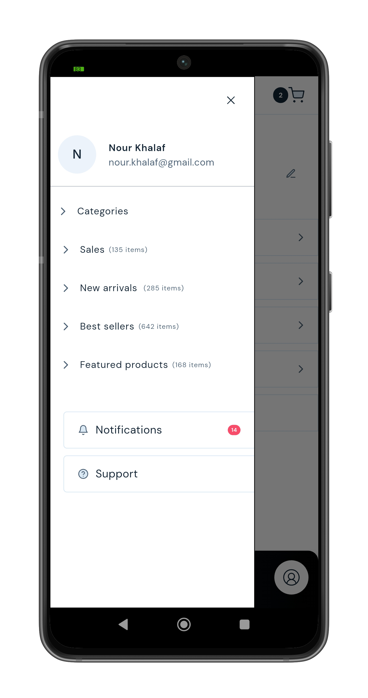

# 🛒 Shopping App Flutter

A feature-based e-commerce mobile application built using Flutter with Clean Architecture principles, scalable structure, and modern development practices.

---

## 📱 Overview

This project is a fully structured shopping application that demonstrates real-world Flutter development practices. It focuses on scalability, maintainability, and clean code organization using a feature-based architecture.

The app integrates APIs, supports pagination, and uses dependency injection for better modularity and testability.

---

##  Features

*  Feature-Based Architecture with Repository Pattern
*  REST API Integration using Dio
*  Dependency Injection (GetIt)
*  Pagination for product lists
*  Product browsing and details
*  Wishlist & cart structure (if implemented)
*  Responsive UI design
*  Reusable components
*  Network layer abstraction
*  Scalable project structure
*  SQLite-based local storage for cart with full CRUD operations
*  SharedPreferences for lightweight local storage

---

## 🏗️ Architecture

The project follows a **Feature-Based Architecture** with the **Repository Pattern**.

```text
lib/
├── config/
├── core/                 # Shared utilities, networking, routing, constants
├── features/
│   ├── auth/
│   │   ├── auth_provider.dart
│   │   ├── auth_repository.dart
│   │   ├── auth_remote_data_source.dart
│   │   └── login_screen.dart
│   ├── home/
│   ├── products/
│   └── cart/
├── main_screen.dart
└── main.dart
```
 

 
---
 
## 🎥 Demo Video

Watch the demo here:
[https://youtu.be/your-video-link](https://youtube.com/shorts/gAQ3jQg3B1M)

 

---
## 📸 Screenshots

<p align="center">

 
  
  
 
  
  
</p>

<p align="center">

  
  
  
 
 
</p>

 <p align="center">
  
  
  
  
 
</p>

</p>
 <p align="center">
  
  
  
 </p>
 <p align="center">
  
  
  
  
</p>
 

## 👩‍💻 Author

**Nour Khalaf**

* GitHub: https://github.com/NourKhalaf-flutter

---

## 📄 License

This project is for educational and portfolio purposes.
